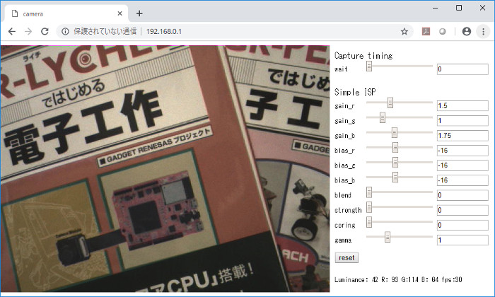

# RZ_A2M_WebCamera_MIPI
This is a sample program that works on RZ/A2M board.  


## Overview
This is a web camera sample program. You can adjust the color tone using "Simple ISP" of the DRP library.  
DRP(Dynamically Reconfigurable Processor) is the programmable hardware which have both the flexibility of software and the speed of hardware. The firmware which define processing, can be renewed immediately.  
Simple ISP is an ISP (Image Signal Processor) most suitable for image recognition, and it performs color component accumulation, color correction, demosaicing, noise reduction, sharpening, and gamma correction on captured data (Bayer array).   

Please see ``mbed-gr-libs/drp-for-mbed/TARGET_RZ_A2XX/r_drp/doc`` for details.  

## Requirements
* [RZ/A2M Evaluation Board Kit](https://www.renesas.com/jp/en/products/software-tools/boards-and-kits/eval-demo/rz-a2m-evaluation-board-kit.html) or [SBEV-RZ/A2M](http://www.shimafuji.co.jp/products/1486)
* RaspberryPi camera
* Ethernet cable
* Computer

## How to use
1. Please change the source code according to the environment to be used before building.  
When connecting the Ethernet cable directly to your computer, please set ``0`` in ``USE_DHCP`` macro of ``main.cpp`` file.  
```cpp
#define USE_DHCP               (0)                 /* Select  0(static configuration) or 1(use DHCP) */
```
When going through the network, please set ``1`` in ``USE_DHCP`` macro of ``main.cpp`` file.  
```cpp
#define USE_DHCP               (1)                 /* Select  0(static configuration) or 1(use DHCP) */
```

2. The IP address is displayed on the terminal. Please open the address in web browser.  
(When USE_DHCP is 0, the IP address is "192.168.0.1".)  
  ```
  ********* PROGRAM START ***********
  Network Setting up...

  Connecting...
  MAC Address is xx:xx:xx:xx:xx:xx
  IP Address is 192.168.0.1
  NetMask is 255.255.255.0
  Gateway Address is 192.168.0.1
  Network Setup OK
  ```

3. You can change each parameter of "Simple ISP" from the Web browser.  
  

4. Switch to web page in SD card (optional)  
When connecting the SD card, ``SDBlockDevice`` will be displayed on the terminal and the web page displayed in the web browser will switch from the built-in ROM to the SD card. The top page is ``index.htm``.  


## Development environment
Please refer to the following.  
https://github.com/d-kato/RZ_A2M_Mbed_samples


## Custom boot loader
By using the custom boot loader, you can drag & drop the .bin file to write the program.  
When using for the first time, please write a custom boot loader. Unzip ``bootloader_d_n_d/elf.zip`` and write the corresponding boot loader. (Refer to ``How to download by use e2studio``.)  


Add ``target.bootloader_img`` and ``target.app_offset`` to ``mbed_app.json`` as below.  
```
{
    "config": {
        "camera":{
            "help": "0:disable 1:enable",
            "value": "1"
        },
        "camera-type":{
            "help": "Please see EasyAttach_CameraAndLCD/README.md",
            "value": null
        },
        "lcd":{
            "help": "0:disable 1:enable",
            "value": "0"
        }
    },
    "target_overrides": {
        "*": {
            "platform.stdio-baud-rate": 115200,
            "platform.stdio-convert-newlines": true,
            "target.macros_add": ["MBED_CONF_APP_MAIN_STACK_SIZE=8192"]
        },
        "RZ_A2M_EVB": {
            "target.bootloader_img" : "bootloader_d_n_d/RZ_A2M_EVB_boot.bin",
            "target.app_offset"     : "0x20000"
        },
        "RZ_A2M_SBEV": {
            "target.bootloader_img" : "bootloader_d_n_d/RZ_A2M_SBEV_boot.bin",
            "target.app_offset"     : "0x20000",
            "target.macros_add"     : ["OVERRIDE_CONSOLE_USBSERIAL"]
        }
    }
}
```

Build the program. Two files ``RZ_A2M_WebCamera_MIPI.bin`` and ``RZ_A2M_WebCamera_MIPI_application.bin`` are created.  

Hold down ``SW3`` and press the reset button. (Or turn on the power.)  
Connect the USB cable to the PC, you can find the ``MBED`` directory.  
Drag & drop ``RZ_A2M_WebCamera_MIPI_application.bin`` to the ``MBED`` directory.  
When writing is completed, press the reset button.  
