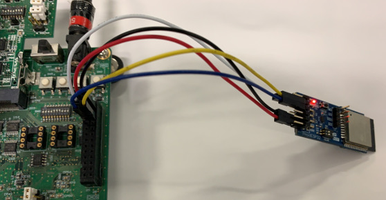

# RZ_A2M_WebCamera_MIPI
This is a sample program that works on RZ/A2M board.  


## Overview
This is a web camera sample program. You can adjust the color tone using "Simple ISP" of the DRP library.  
DRP(Dynamically Reconfigurable Processor) is the programmable hardware which have both the flexibility of software and the speed of hardware. The firmware which define processing, can be renewed immediately.  
Simple ISP is an ISP (Image Signal Processor) most suitable for image recognition, and it performs color component accumulation, color correction, demosaicing, noise reduction, sharpening, and gamma correction on captured data (Bayer array).   

Please see ``mbed-gr-libs/drp-for-mbed/TARGET_RZ_A2XX/r_drp/doc`` for details.  

## Requirements
* GR-MANGO alpha version, [RZ/A2M Evaluation Board Kit](https://www.renesas.com/jp/en/products/software-tools/boards-and-kits/eval-kits/rz-a2m-evaluation-board-kit.html) , [SBEV-RZ/A2M](http://www.shimafuji.co.jp/products/1486) or [SEMB1402](http://www.shimafuji.co.jp/products/1505)
* RaspberryPi camera
* Computer

#### In the case of Ethernet Connection
* GR-MANGO alpha version, RZ/A2M Evaluation Board Kit or SBEV-RZ/A2M
  * Ethernet cable
* SEMB1402
  * Not supported

#### In the case of WiFi Connection
* GR-MANGO alpha version
  * [Pmod ESP32](https://store.digilentinc.com/pmod-esp32-wireless-communication-module/)  
    
    
* RZ/A2M Evaluation Board Kit
  * [Pmod ESP32](https://store.digilentinc.com/pmod-esp32-wireless-communication-module/)  
    
    
* SBEV-RZ/A2M or SEMB1402
  * IoT-Engine WIFI ESP32 (SEMB1401-1)


## About custom boot loaders
**<font color="Red">Attention! GR-MANGO alpha version is not supported.</font>**  
This sample uses a custom boot loader, and you can drag & drop the "xxxx_application.bin" file to write the program.  

1. Hold down ``SW3`` and press the reset button. (Or turn on the power.)  
2. Connect the USB cable to the PC, you can find the ``MBED`` directory.  
3. Drag & drop ``xxxx_application.bin`` to the ``MBED`` directory.  
4. When writing is completed, press the reset button.  

**Attention!**  
This sample program uses custom boot loaders ``revision 3`` .  
For the first time only, you need to write a custom bootloader as following.  
[How to write a custom boot loader](https://github.com/d-kato/bootloader_d_n_d)  


## How to use
1. Please change the source code according to the environment to be used before building.  
When connecting the Ethernet cable directly to your computer, please set ``0`` in ``USE_DHCP`` macro of ``main.cpp`` file.  
```cpp
#define USE_DHCP               (0)                 /* Select  0(static configuration) or 1(use DHCP) */
```
When going through the network, please set ``1`` in ``USE_DHCP`` macro of ``main.cpp`` file.  
```cpp
#define USE_DHCP               (1)                 /* Select  0(static configuration) or 1(use DHCP) */
```

2. **This step is only if you are using WiFi.**  
  When you press the reset button of RZ/A2M board, the scan result of Wifi will be output on Terminal.  
  ```
  ********* PROGRAM START ***********
  Network Setting up...
  Scan:
  No.0 Network: SSID_1 secured: WPA/WPA2 BSSID: xx:xx:xx:xx:xx:xx RSSI: -52 Ch: 1
  No.1 Network: SSID_2 secured: Unknown BSSID: xx:xx:xx:xx:xx:xx RSSI: -67 Ch: 2
  2 networks available.

  Please enter the number of the network you want to connect.
  Enter key:[0]-[1], (If inputting the other key, it's scanned again.)
  ```
  Enter the number of the network you want to connect from the keyboard.
  To select SSID_1, press "0" on the keyboard.  
  ```
  [SSID_1] is selected.
  please enter the PSK.
  ```
  Finally, enter the password to connect to the network.    


3. The IP address is displayed on the terminal. Please open the address in web browser.  
(When USE_DHCP is 0, the IP address is "192.168.0.1".)  
  ```
  ********* PROGRAM START ***********
  Network Setting up...

  Connecting...
  MAC Address is xx:xx:xx:xx:xx:xx
  IP Address is 192.168.0.1
  NetMask is 255.255.255.0
  Gateway Address is 192.168.0.1
  Network Setup OK
  ```

4. You can change each parameter of "Simple ISP" from the Web browser.  
  

5. Switch to web page in SD card (optional)  
When connecting the SD card, ``SDBlockDevice`` will be displayed on the terminal and the web page displayed in the web browser will switch from the built-in ROM to the SD card. The top page is ``index.htm``.  


### Change network connection
You can change the network connection by changing the following macro in ``main.cpp``.  

```cpp
/**** User Selection *********/
/** Network setting **/
#if defined(TARGET_SEMB1402)
  #define USE_DHCP             (1)                 /* Select  0(static configuration) or 1(use DHCP) */
  #define NETWORK_TYPE         (2)                 /* Select  0(Ethernet), 1(BP3595), 2(ESP32 STA) ,3(ESP32 AP) */
#else
  #define USE_DHCP             (0)                 /* Select  0(static configuration) or 1(use DHCP) */
  #define NETWORK_TYPE         (0)                 /* Select  0(Ethernet), 1(BP3595), 2(ESP32 STA) ,3(ESP32 AP) */
#endif
#if (USE_DHCP == 0)
  #define IP_ADDRESS           ("192.168.0.1")     /* IP address      */
  #define SUBNET_MASK          ("255.255.255.0")   /* Subnet mask     */
  #define DEFAULT_GATEWAY      ("192.168.0.1")     /* Default gateway */
#endif
#if (NETWORK_TYPE >= 1)
  #define SCAN_NETWORK         (1)                 /* Select  0(Use WLAN_SSID, WLAN_PSK, WLAN_SECURITY) or 1(To select a network using the terminal.) */
  #define WLAN_SSID            ("SSIDofYourAP")    /* SSID */
  #define WLAN_PSK             ("PSKofYourAP")     /* PSK(Pre-Shared Key) */
  #define WLAN_SECURITY        NSAPI_SECURITY_WPA_WPA2 /* NSAPI_SECURITY_NONE, NSAPI_SECURITY_WEP, NSAPI_SECURITY_WPA, NSAPI_SECURITY_WPA2 or NSAPI_SECURITY_WPA_WPA2 */
#endif
```

The following connection method is switched depending on the value set in ``NETWORK_TYPE``.

| Number | Connection | Description                                   |
|:-------|:-----------|:----------------------------------------------|
| 0      | Ethernet   | Use Ethernet.                                 |
| 1      | BP3595     | Not supported.                                |
| 2      | ESP32 STA  | Use ESP32 in STA mode.                        |
| 3      | ESP32 AP   | Use ESP32 in AP mode.                         |

* In the case ``NETWORK_TYPE = 2``  
  WLAN_SSID, WLAN_PSK and WLAN_SECURITY set the information of the access point to be connected. However, in the case of ``SCAN_NETWORK = 1``, these values are not referenced, and the connection destination is selected based on the scan result displayed on Terminal.  

* In the case ``NETWORK_TYPE = 3``  
 WLAN_SSID, WLAN_PSK and WLAN_SECURITY set the information as AP published by ESP32.  

### Change the size of camera input images
You can change the size of camera input images by changing the macro below in ``main.cpp``.   
``JPEG_ENCODE_QUALITY`` sets the quality of JPEG encoding.
The upper limit of "SetQuality()" is **100**, but consider the size of the memory storing the JPEG conversion result etc., the upper limit should be about **75**.  

```cpp
/** JPEG out setting **/
#define JPEG_ENCODE_QUALITY    (75)                /* JPEG encode quality (min:1, max:75 (Considering the size of JpegBuffer, about 75 is the upper limit.)) */
```

In addition, you can change the number of pixels of the image by changing the following. As the number of pixels decreases, the transfer data decreases.

```cpp
#define VIDEO_PIXEL_HW       (320u)  /* QVGA */
#define VIDEO_PIXEL_VW       (240u)  /* QVGA */
```


### LCD setting
You can turn on the LCD display by changing the ``mbed_app.json`` file.  
When the LCD is enabled, camera images are not displayed in the web browser. Only the ISP setting screen is displayed.  
Please refer to ``mbed-gr-libs/EasyAttach_CameraAndLCD/README.md`` for details.  
```
{
    "config": {
        === omit ===
        "lcd":{
            "help": "0:disable 1:enable",
            "value": "1"
        },
        === omit ===
```
**Requirements**
* ``RZ/A2M Evaluation Board Kit`` : Display Output Board  
* ``SBEV-RZ/A2M`` : LVDS To HDMI Board  
* ``SEMB1402`` : LVDS To HDMI Board  


## Development environment
Please refer to the following.  
https://github.com/d-kato/RZ_A2M_Mbed_samples
